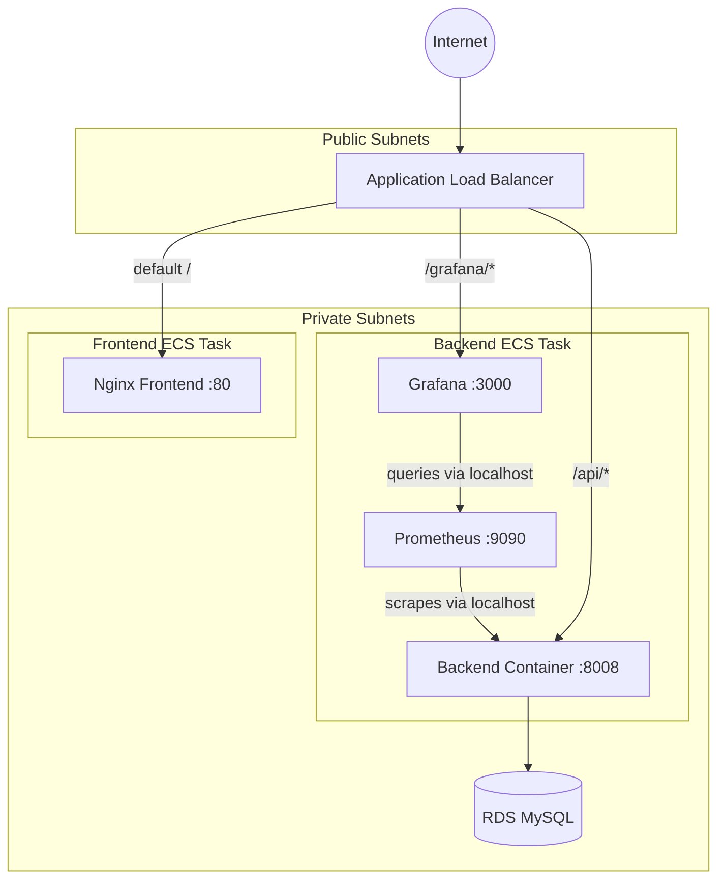

# Demena

A full-stack todo application deployed end-to-end on AWS using Infrastructure as Code, with sidecar observability and a CI/CD pipeline.

The application itself is intentionally simple — auth, todos, CRUD. The point of the project is the layer underneath: 41 AWS resources provisioned with Terraform, a three-container ECS Fargate task running backend + Prometheus + Grafana, and a GitHub Actions pipeline that handles testing, image builds, and deployments.

---

## Status

**Shipped.** Infrastructure paused between demos to keep costs down (~$5/month for ECR storage when paused, ~$90/month when fully running). The full stack can be brought back up with one `terraform apply` in about 12 minutes.

---

## Architecture



### Why a sidecar pattern for observability

Prometheus and Grafana run as additional containers inside the same ECS task as the backend. They share the task's network namespace, so Prometheus scrapes the backend at `localhost:8008` without service discovery, and Grafana queries Prometheus at `localhost:9090`. The trade-off is operational coupling — all three containers restart together. For a single-team portfolio project this is fine. In a real production setup with multiple teams I'd run Grafana as its own ECS service so the observability stack could ship independently of the application.

---

## Tech stack

**Frontend.** React 18, TypeScript, Redux Toolkit, React Router, Tailwind CSS, Vite. Built into a Docker image, served by Nginx.

**Backend.** Node.js, Express, TypeScript, TypeORM, MySQL. JWT auth (bcrypt for password hashing). Jest + Supertest for tests, run on every PR.

**Observability.** `prom-client` for backend instrumentation. Prometheus sidecar scraping the backend's `/metrics` endpoint. Grafana sidecar with dashboards and data source provisioned as code.

**Infrastructure.** AWS Fargate, RDS MySQL, ALB, VPC with public/private subnets, NAT Gateway, ECR, IAM, CloudWatch, SNS. ~41 resources, all defined in Terraform and deployable in one command.

**CI/CD.** GitHub Actions. Three workflows: tests on every PR, image builds on merge to main, ECS deployments triggered automatically. AWS auth via stored credentials (OIDC migration is a planned follow-up).

---

## Repo layout

Below is the directory structure for this repository, outlining the core components of the full-stack application and its infrastructure.

| Directory / File | Description |
| :--- | :--- |
| **`backend/`** | Express + TypeORM API, includes Jest unit and integration tests. |
| **`frontend/`** | React + Redux application bootstrapped with Vite. |
| **`prometheus/`** | Monitoring setup including Dockerfile and scrape configurations. |
| **`grafana/`** | Observability dashboards and automated datasource provisioning. |
| **`terraform/`** | Infrastructure as Code for AWS (VPC, ECS, RDS, ALB, ECR, IAM, CloudWatch). |
| **`.github/workflows/`** | CI/CD pipelines for automated testing (`test.yml`) and deployment (`deploy.yml`). |
| **`docs/`** | Project documentation and supplementary materials. |
| ↳ `debugging-journal.md` | A log of real production bugs encountered and their solutions. |
| ↳ `post-drafts.md` | Content strategy and LinkedIn post angles for project showcasing. |

---

## Running locally

```bash
docker compose up
```

Brings up frontend (port 3000), backend (port 8008), and MySQL. Frontend's Vite dev server proxies `/api/*` to the backend so there's no CORS dance.

For backend tests:

```bash
cd backend
npm install
npm test
```

25 tests across two suites. Aiming for >80% coverage on routes, controllers, and middleware.

---

## Deploying to AWS

Terraform brings up everything from scratch in a single apply:

```bash
cd terraform
terraform init
terraform apply
```

Takes 10–12 minutes. RDS is the long pole. The output gives you the ALB DNS name. The CI pipeline pushes images to ECR and triggers ECS deployments on every merge to `main`.

Tearing down:

```bash
terraform destroy
```

ECR repositories will refuse to delete if they still have images — that's intentional, you can either force-delete via console or leave them for the next apply. Everything else goes away cleanly.

This destroy/recreate pattern is deliberate. Demena costs about $90 CAD/month if left running 24/7 (NAT Gateway + RDS + ECS dominate). Tearing it down between demos drops that to ~$5/month for ECR storage. Recreating from scratch takes about 12 minutes. For a portfolio project this is the right trade-off.

---

## Debugging stories

The most useful part of this project wasn't the happy-path deploy — it was the bugs that surfaced when the abstractions leaked. Six are written up as engineering log entries on [amtenu.ca/log](https://amtenu.ca/log) and indexed in [`docs/debugging-journal.md`](docs/debugging-journal.md):

- **Empty ECR repos blocked the first apply** — chicken-and-egg between Terraform and CI.
- **`/grafana` returned the frontend instead of Grafana** — ALB path patterns are exact-prefix, so `/grafana/*` doesn't match the bare path.
- **Frontend in production was calling `localhost:8000`** — Vite bakes API URLs at build time, and CI never passed one.
- **Backend was running a stale image** — `terraform/ecs.tf` pinned `:v5` while CI only pushed commit-SHA tags.
- **Metrics labels mismatched between code and dashboard** — middleware recorded `endpoint`, dashboard queried by `route`. PromQL silently returned nothing.
- **Grafana panels showed "Datasource not found"** — provisioned datasource auto-generated a UID; dashboard JSON hardcoded a different one.
- **CI race between sidecar builds and backend deploy** (caught preemptively) — parallel jobs meant ECS could roll a new task before sidecar `:latest` tags were pushed.

---

## Things I'd do differently next time

- **Bootstrap ECR separately from the main Terraform stack.** The current setup creates ECR repos in the same `terraform apply` that creates ECS, which causes a chicken-and-egg problem on first deploy after a destroy. Pulling ECR into a separate `bootstrap/` Terraform stack would solve this cleanly.
- **Migrate AWS auth in CI to OIDC.** Stored access keys are the standard quick start; OIDC federation is the right answer.
- **Move Terraform state to S3 + DynamoDB.** Local state is fine for a solo project but breaks the moment another person touches it.
- **HTTPS via ACM + Route 53.** The current ALB is HTTP-only because I haven't registered a domain for this project. Mechanical work, not architectural.
- **Move secrets to AWS Secrets Manager.** Database password and JWT secret are currently hardcoded in the task definition. The right answer is the `secrets` block in the container definition pulling from Secrets Manager or SSM Parameter Store.

---

## Project phases

| Phase | What                                                     | Status |
| ----- | -------------------------------------------------------- | ------ |
| 1     | Repo setup, project structure                            | ✅     |
| 2     | Frontend (React, Redux, Tailwind)                        | ✅     |
| 3     | Backend (Express, TypeORM, JWT, TDD)                     | ✅     |
| 4     | Local Docker Compose integration                         | ✅     |
| 5     | AWS infrastructure (Terraform)                           | ✅     |
| 6     | Observability (Prometheus + Grafana sidecar, CloudWatch) | ✅     |
| 7     | CI/CD pipeline (GitHub Actions)                          | ✅     |

---

## License

MIT.

